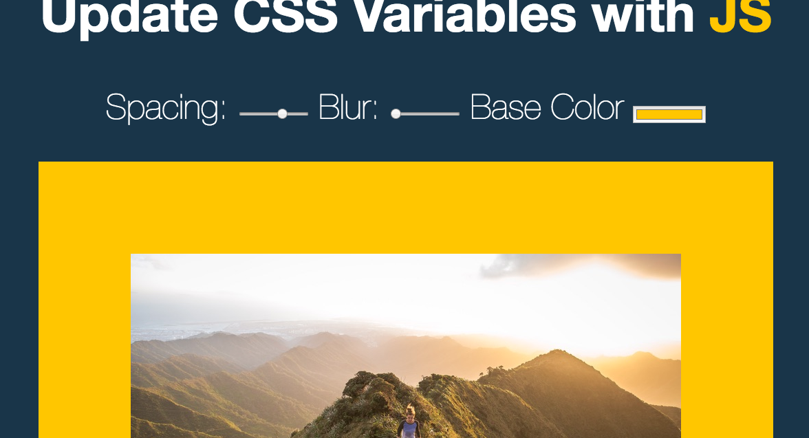
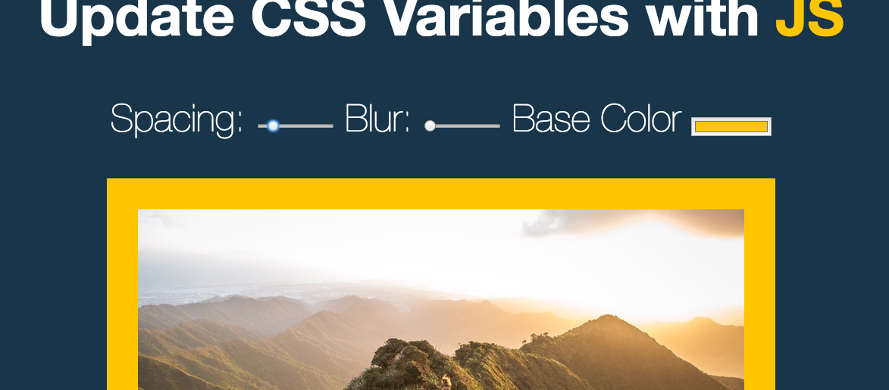
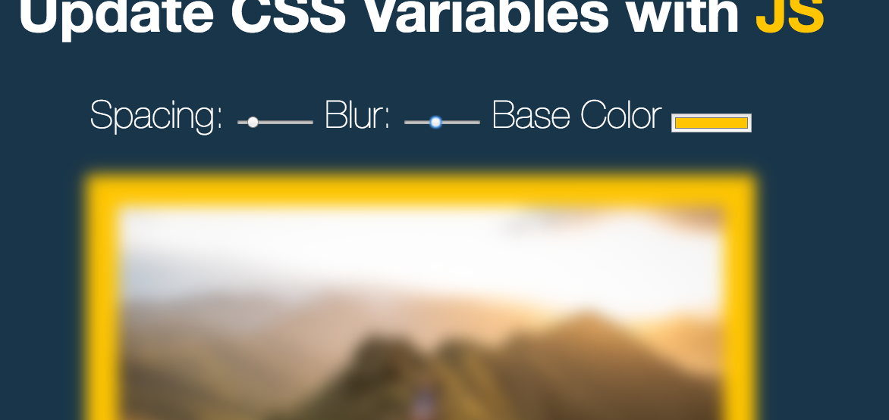
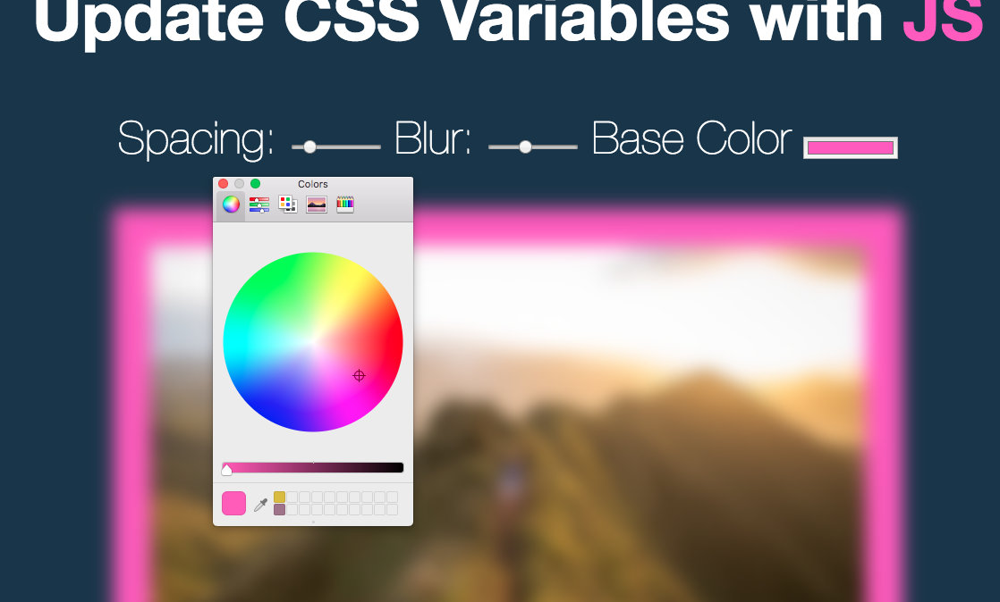

## CSS variables

In todays challenged I was introduced to CSS Variables, which is quite similar to the variables we create using SASS however the main difference between the both is that css variables can be updated with JavaScript, whereas it is more hectic to do the same using SASS.

The file which has three inputs - blur, spacing (padding) and colour.

Using the the JavaScript setProperty method, we grabbed the value and the suffix of the input and updated our file accordingly.

As we dealt variables without a suffix, we manually created our own suffix by adding our own data attributes, then using 'dataSet' to grab the specific suffix for the input.

The most important thing I take away from the challenge, was not only the use of CSS variables, but overcoming the challenge of working with values such as hex colours, that have no suffix.
Custom data attributes make the whole process much more easier to complete. 
